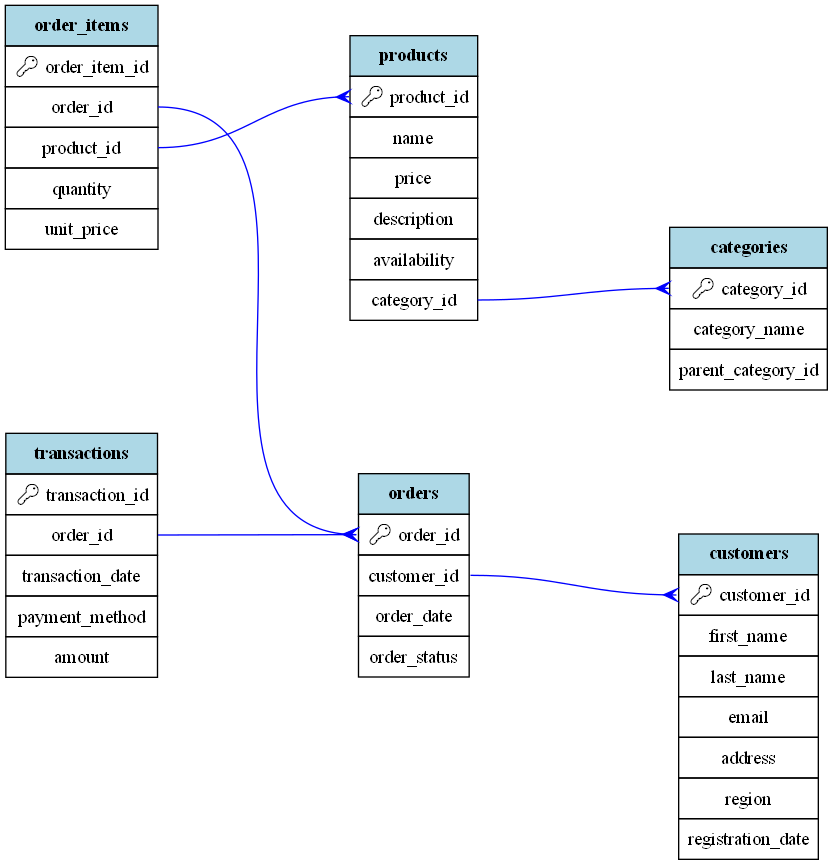

# Riešenie úlohy 1: Návrh dátového modelu pre E-commerce

Táto časť obsahuje návrh dátového modelu pre e-commerce platformu podľa zadania od spoločnosti GymBeam. Súčasťou je SQL schéma, ER diagram a vysvetlenie analytického modelu.

---

### 1. ER Diagram a SQL Schéma

Navrhnutý relačný model pokrýva všetky kľúčové entity: produkty, kategórie, zákazníkov, objednávky a transakcie.

* `create_tables.sql` obsahuje DDL príkazy na vytvorenie všetkých tabuliek s definovanými primárnymi a cudzími kľúčmi.
* Nižšie je zobrazený ER diagram, ktorý vizualizuje vzťahy medzi tabuľkami. Bol vygenerovaný automaticky pomocou Python skriptu `generate_er.py`.



---

### 2. Analytický Model (Star Schema)

Pre potreby analýzy predajov bol model navrhnutý tak, aby priamo podporoval star schema. Tento prístup je ideálny pre rýchle agregácie a reporting v BI nástrojoch.

* **Faktová tabuľka (Fact Table):**
    * `order_items`: Obsahuje kľúčové metriky ako `quantity` a `unit_price` a spája jednotlivé dimenzie.

* **Dimenzionálne tabuľky (Dimension Tables):**
    * `customers`: Poskytuje dimenziu zákazníka (kto nakúpil, z akého regiónu).
    * `products`: Dimenzia produktu (čo sa predalo).
    * `categories`: Hierarchická dimenzia kategórií.
    * `orders`: Poskytuje dimenziu času (dátum objednávky) a stavu. Pre pokročilejšiu analýzu by sa dala vytvoriť samostatná tabuľka `dim_date`.

---

### 3. Riešenie Historických Zmien (Slowly Changing Dimensions)

Dodatočná otázka sa týkala riešenia historických zmien, napríklad ceny produktu.

Na tento účel som navrhol prístup **SCD (Slowly Changing Dimension) Type 2**. Tento prístup uchováva kompletnú históriu zmien v samostatnej tabuľke. Pre zmenu ceny produktu by tabuľka vyzerala takto:

```sql
CREATE TABLE product_price_history (
    price_history_id INT PRIMARY KEY,
    product_id INT REFERENCES products(product_id),
    price DECIMAL(10,2),
    effective_from TIMESTAMP,
    effective_to TIMESTAMP,
    is_current BOOLEAN
);
```
Tento dizajn umožňuje presne analyzovať predaje s cenou, ktorá bola platná v čase každej objednávky.

---

### 4. Inštrukcie na Spustenie

1.  Nainštalujte potrebné Python knižnice:
    ```bash
    pip install duckdb graphviz
    ```
2.  Spustite skript na generovanie ER diagramu:
    ```bash
    python generate_er.py
    ```
    Tento príkaz vytvorí súbor `er_from_sql_columns.png` na základe schémy v `create_tables.sql`.